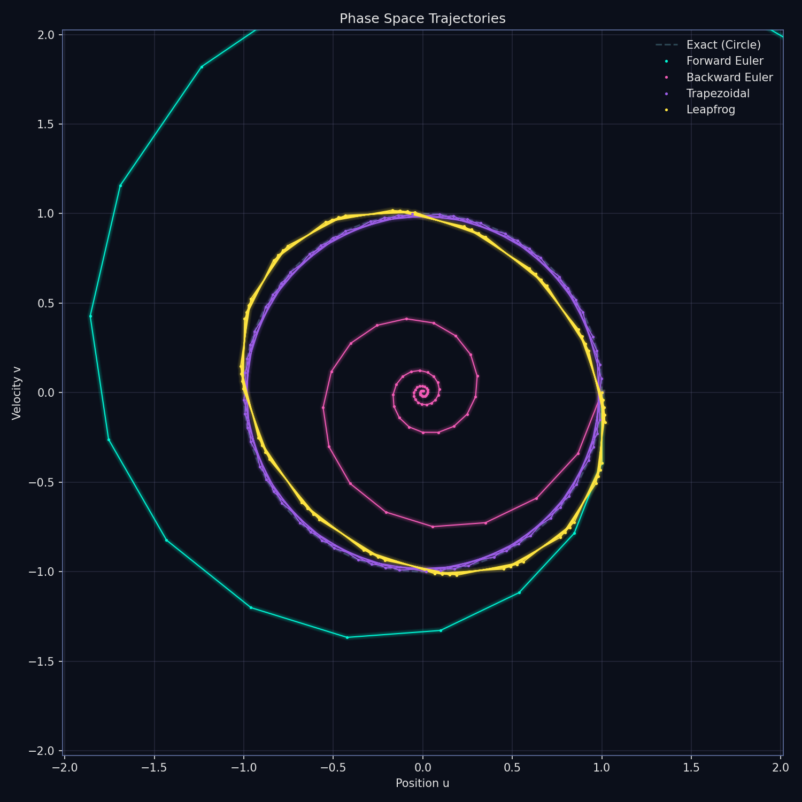
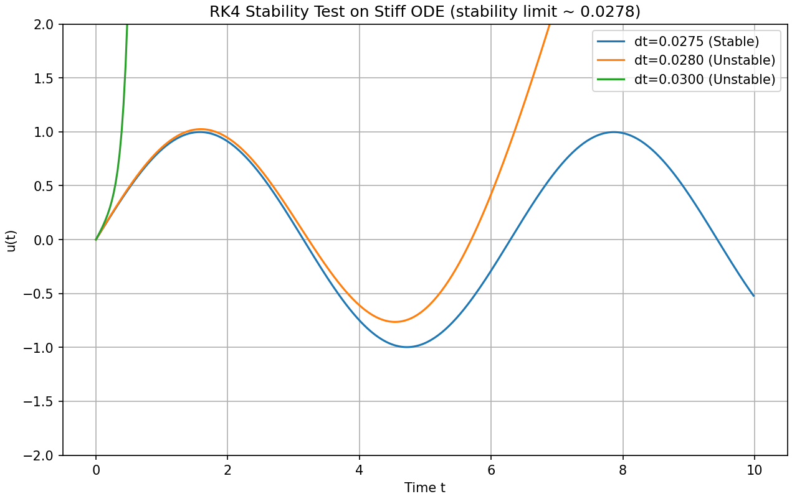

# study_cse

数値計算・解析の勉強

## 授業

### 数値解析学のレポート課題成果物

- 前半レポート: [数値解析学/前半/README.md](数値解析学/前半/README.md)
- 後半レポート: [数値解析学/後半/report/README.md](数値解析学/後半/report/README.md)

## 自学

### 円軌道の数値積分

### 4次ルンゲクッタで数値計算安定性が失われる様子

問題設定（硬い微分方程式）:  
$u' = -100u + 100\sin(t),\ u(0) = 0$

