# 数値解析学：前半レポート

## 問題2：ホイン法（Heun 法）

### 数値解と厳密解（h=1.0）

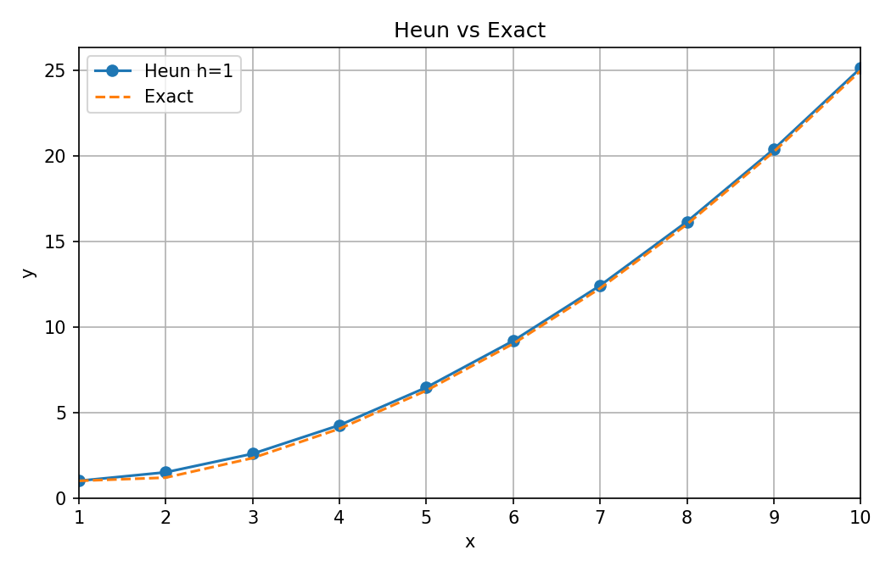

### 絶対誤差の比較（h=1.0 / 0.5）

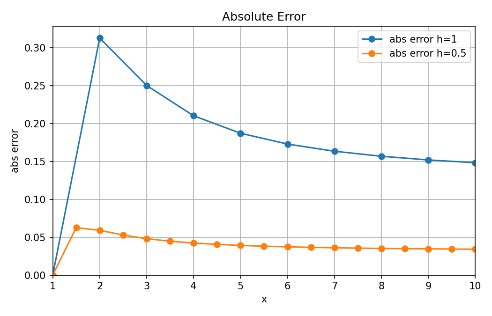

## 問題3：境界値問題（重ね合わせ + RK4）

### 数値解

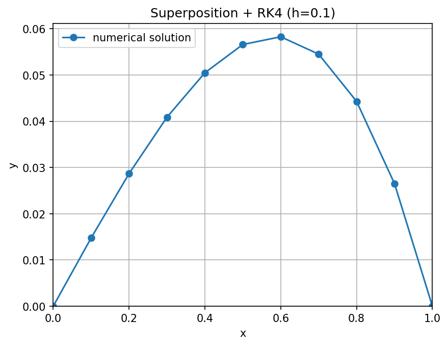

### 感度：最大誤差の分布

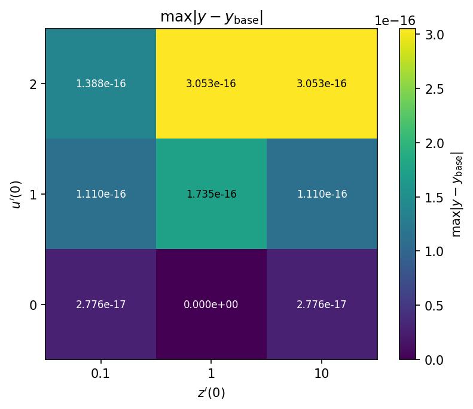

### 感度：係数 C の分布

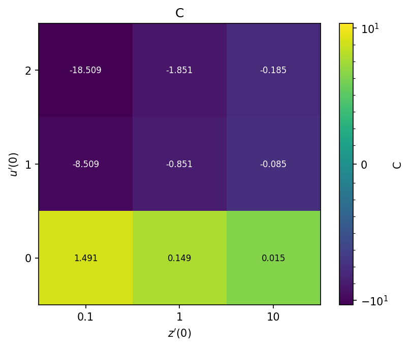

## 問題4：べき乗法（Power Method）

### 残差ノルム比の推移

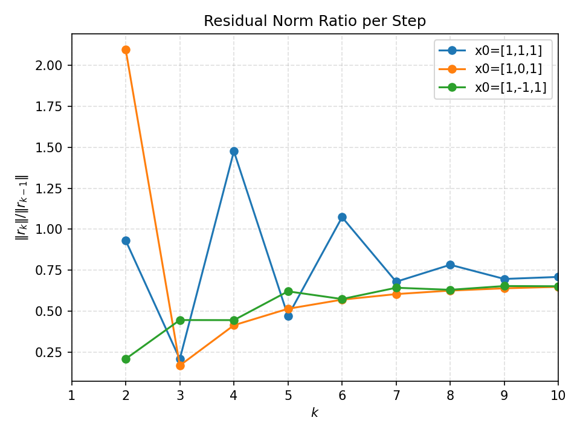

### 固有値・固有ベクトル誤差の推移

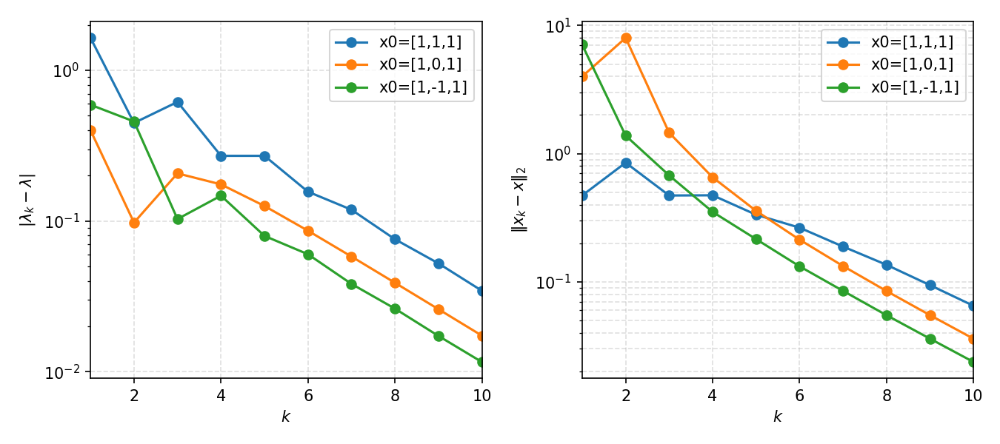

### 反復の様子（アニメーション）

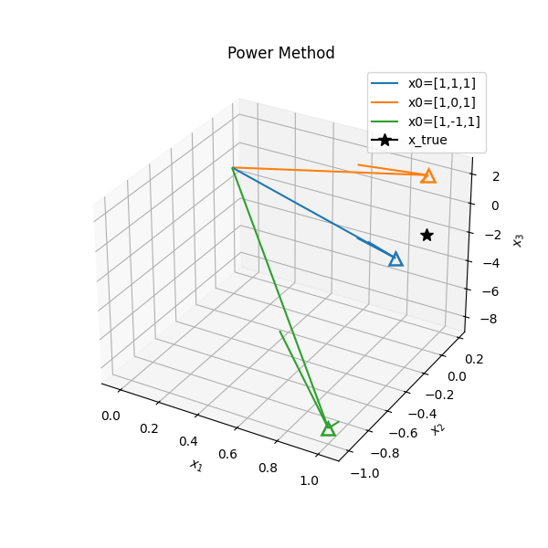

## 問題5：ヤコビ法（Jacobi 法）

### オフ対角成分ノルムの収束

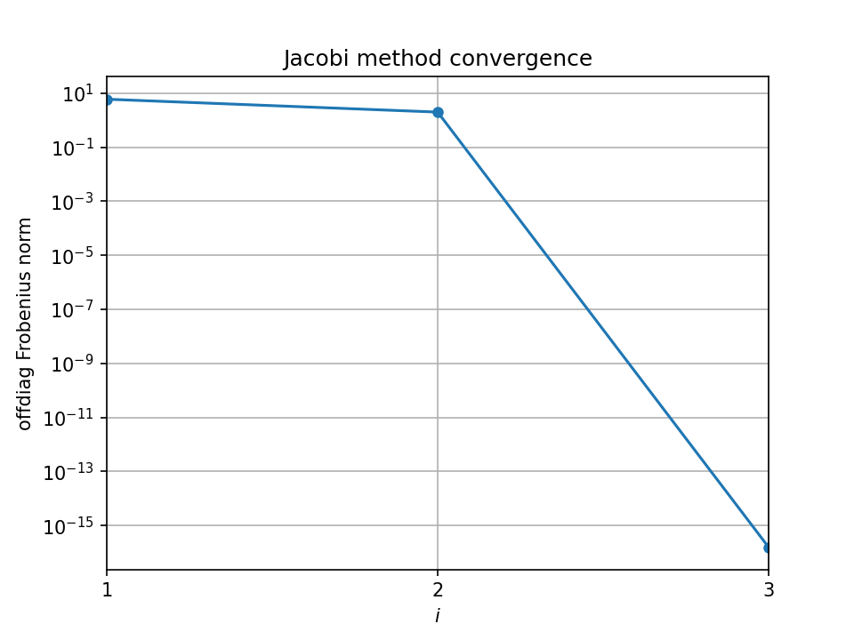

### 固有値の収束（最大ピボット）

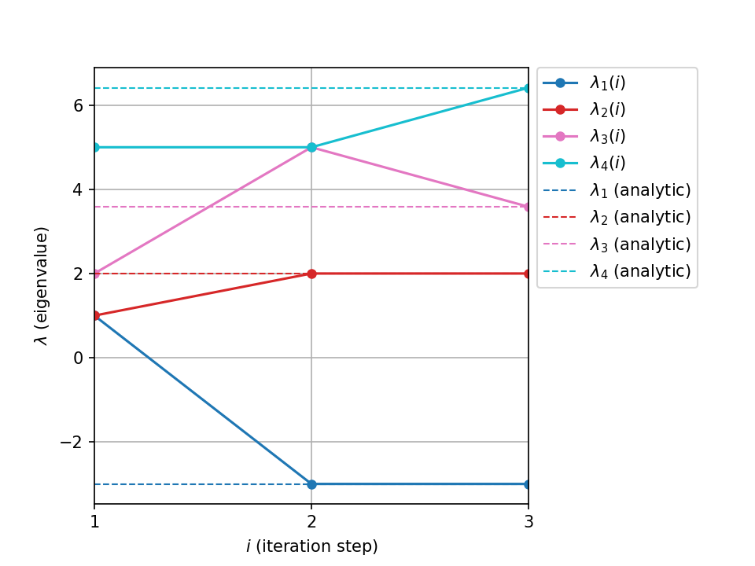

### 固有値の収束（サイクリック）

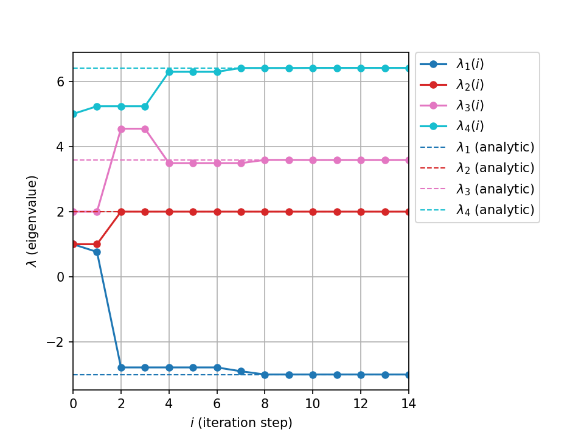

### 行列のヒートマップ（最大ピボット）

### 行列のヒートマップ（サイクリック）

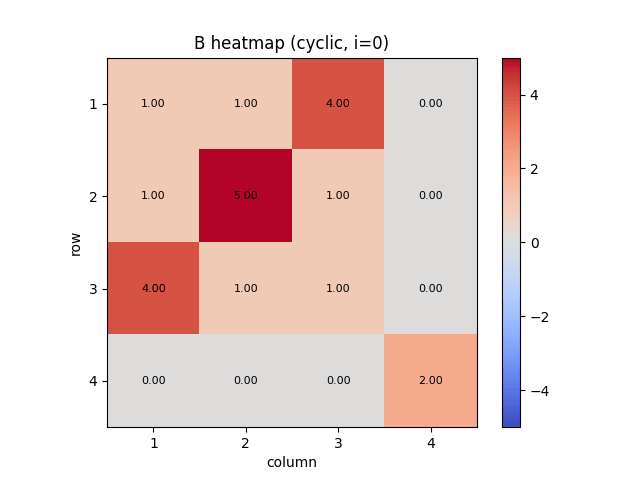

### B・G・X の並列表示

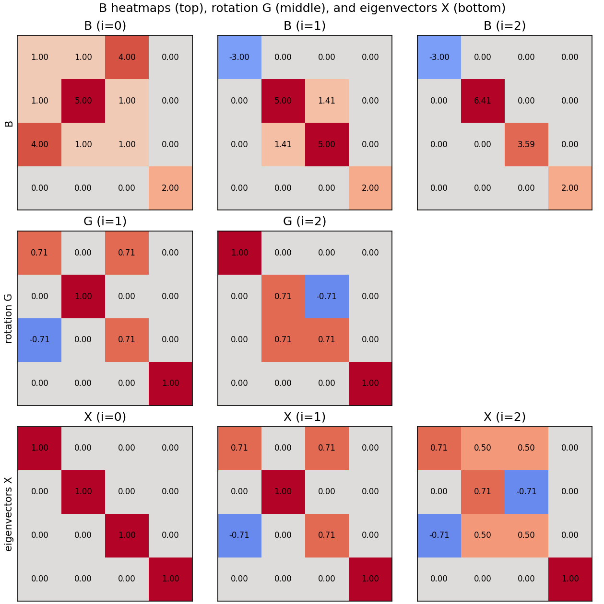
